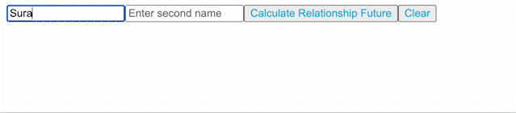

## They say friendship is greater than love. Why not play the famous game "FLAMES".
<pre>
Note: Refer the below gif.

The rules are super simple. Given two strings (all lowercase), remove all the letters that are common to both the strings from both the strings. You cannot erase two characters corresponding to one character.

For example,
String 1: Soumya
String 2: ansh
You can remove only 1 'a' and 1 's' from both the strings.
The remaining strings are:
String 1: Soumy
String 2: nsh

Now all you need to do is find the sum of the remaining strings length % 6.

Output:

If the obtained value is 1, output "Friends".

If the obtained value is 2, output "Love".

If the obtained value is 3, output "Affection".

If the obtained value is 4, output "Marriage".

If the obtained value is 5, output "Enemy".

If the obtained value is 0, output "Siblings".

If any of the input is blank then output "Please Enter valid input".
Steps:

Take-Two Input: First Name, Second Name.
Button Text: 'Calculate Relationship Future'.
Onclick of the button, evaluate status using the logic above.
Render output in an h3 tag.
Clear Button- > Clear inputs and relationship status.
</pre>
## Description:

<pre>
You need to make two input box inside App component one input box with data-testid="input1", and second input box with data-testid="input2".
You need to make buttons one with data-testid="calculate_relationship", and second with data-testid="clear".
  
Create h3 element tag inside which you will render your answer & give data-testid="answer".
Input should be considered case-sensitive.
</pre>

